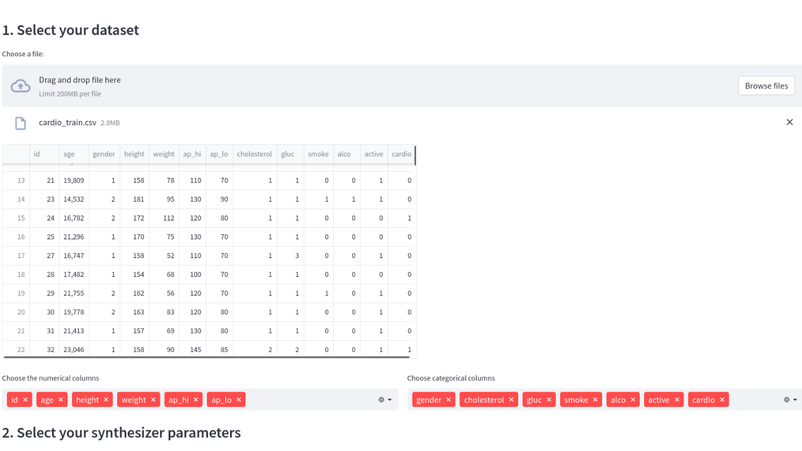

[](https://pypi.org/project/ydata-synthetic/)

[](https://pypi.org/project/ydata-synthetic/)


<p align="center"></p>

Join us on [](https://discord.gg/mw7xjJ7b7s)

# YData Synthetic
A package to generate synthetic tabular and time-series data leveraging the state of the art generative models.

## 🎊 We have **big news**: v1.0.0 is here
> We have exciting news for you. The new version of `ydata-synthetic` include new and exciting features:
  > - A conditional architecture for tabular data: CTGAN, which will make the process of synthetic data generation easier and with higher quality!
  > - A new streamlit app that delivers the synthetic data generation experience with a UI interface

## Synthetic data
### What is synthetic data?
Synthetic data is artificially generated data that is not collected from real world events. It replicates the statistical components of real data without containing any identifiable information, ensuring individuals' privacy.

### Why Synthetic Data?
Synthetic data can be used for many applications:
  - Privacy
  - Remove bias
  - Balance datasets
  - Augment datasets

# ydata-synthetic
This repository contains material related with Generative Adversarial Networks for synthetic data generation, in particular regular tabular data and time-series.
It consists a set of different GANs architectures developed using Tensorflow 2.0. Several example Jupyter Notebooks and Python scripts are included, to show how to use the different architectures.

## Quickstart
The source code is currently hosted on GitHub at: https://github.com/ydataai/ydata-synthetic

Binary installers for the latest released version are available at the [Python Package Index (PyPI).](https://pypi.org/project/ydata-synthetic/)
```commandline
pip install ydata-synthetic
```

### The UI guide for synthetic data generation

YData synthetic has now a UI interface to guide you through the steps and inputs to generate structure tabular data.
The streamlit app is available form *v1.0.0* onwards, and supports the following flows:
- Train a synthesizer model
- Generate & profile synthetic data samples

#### Installation

```commandline
pip install ydata-syntehtic[streamlit]
```
#### Quickstart
Use the code snippet below in a python file (Jupyter Notebooks are not supported):
```python
from ydata_synthetic import streamlit_app

streamlit_app.run()
```

Or use the file streamlit_app.py that can be found in the [examples folder](https://github.com/ydataai/ydata-synthetic/tree/master/examples/streamlit_app.py).

```commandline
python -m streamlit_app
```

The below models are supported:
  - CGAN
  - WGAN
  - WGANGP
  - DRAGAN
  - CRAMER
  - CTGAN

[](https://youtu.be/ep0PhwsFx0A)

### Examples
Here you can find usage examples of the package and models to synthesize tabular data.
  - Synthesizing the minority class with VanillaGAN on credit fraud dataset  [](https://colab.research.google.com/github/ydataai/ydata-synthetic/blob/master/examples/regular/gan_example.ipynb)
  - Time Series synthetic data generation with TimeGAN on stock dataset [](https://colab.research.google.com/github/ydataai/ydata-synthetic/blob/master/examples/timeseries/TimeGAN_Synthetic_stock_data.ipynb)
  - More examples are continuously added and can be found in `/examples` directory.

### Datasets for you to experiment
Here are some example datasets for you to try with the synthesizers:
#### Tabular datasets
- [Adult census](https://archive.ics.uci.edu/ml/datasets/adult)
- [Credit card fraud](https://www.kaggle.com/mlg-ulb/creditcardfraud)
- [Cardiovascular Disease dataset](https://www.kaggle.com/datasets/sulianova/cardiovascular-disease-dataset)

#### Sequential datasets
- [Stock data](https://github.com/ydataai/ydata-synthetic/tree/master/data)

## Project Resources

In this repository you can find the several GAN architectures that are used to create synthesizers:

### Tabular data
  - [GAN](https://arxiv.org/abs/1406.2661)
  - [CGAN (Conditional GAN)](https://arxiv.org/abs/1411.1784)
  - [WGAN (Wasserstein GAN)](https://arxiv.org/abs/1701.07875)
  - [WGAN-GP (Wassertein GAN with Gradient Penalty)](https://arxiv.org/abs/1704.00028)
  - [DRAGAN (On Convergence and stability of GANS)](https://arxiv.org/pdf/1705.07215.pdf)
  - [Cramer GAN (The Cramer Distance as a Solution to Biased Wasserstein Gradients)](https://arxiv.org/abs/1705.10743)
  - [CWGAN-GP (Conditional Wassertein GAN with Gradient Penalty)](https://cameronfabbri.github.io/papers/conditionalWGAN.pdf)
  - [CTGAN (Conditional Tabular GAN)](https://arxiv.org/pdf/1907.00503.pdf)

### Sequential data
  - [TimeGAN](https://papers.nips.cc/paper/2019/file/c9efe5f26cd17ba6216bbe2a7d26d490-Paper.pdf)

## Contributing
We are open to collaboration! If you want to start contributing you only need to:
  1. Search for an issue in which you would like to work. Issues for newcomers are labeled with good first issue.
  2. Create a PR solving the issue.
  3. We would review every PRs and either accept or ask for revisions.

## Support
For support in using this library, please join our Discord server. Our Discord community is very friendly and great about quickly answering questions about the use and development of the library. [Click here to join our Discord community!](https://discord.com/invite/mw7xjJ7b7s)

## License
[MIT License](https://github.com/ydataai/ydata-synthetic/blob/master/LICENSE)
